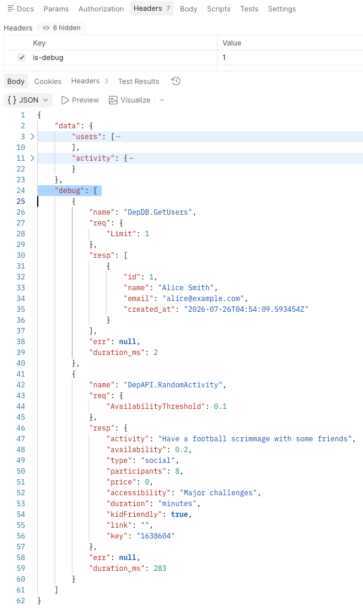

# context-debug

[](https://github.com/iruvan/context-debug/actions/workflows/test.yml)
[](https://pkg.go.dev/github.com/iruvan/context-debug)

A tiny Go package for collecting per-dependency-call debug data (name,
request, response, error, duration) on a `context.Context`, so a service can
attach a debug trail to a request and return it only when debug mode is on —
no global state, no changes to function signatures.

## Install

```
go get github.com/iruvan/context-debug
```

## Usage

```go
import contextdebug "github.com/iruvan/context-debug"

// Enable debug collection for this request (e.g. behind a header/flag).
ctx = contextdebug.New(ctx)

// Inside a dependency call, record what happened. This is a no-op if
// debug mode was never enabled on ctx.
start := time.Now()
resp, err := someDependencyCall(ctx, req)
contextdebug.Collect(ctx, contextdebug.Entry{
	Name:       "DepDB.GetUsers",
	Request:    req,
	Response:   resp,
	Error:      err,
	DurationMs: int(time.Since(start).Milliseconds()),
})

// Later (e.g. when building the HTTP response), pull everything collected.
if contextdebug.Enabled(ctx) {
	entries := contextdebug.Snapshot(ctx) // []contextdebug.Entry
}
```

### Capping the number of entries

By default a debug store keeps every entry it's given. Pass `Option` to
`New` to cap it, so a request that fans out to many dependencies can't grow
the debug trail unbounded:

```go
ctx = contextdebug.New(ctx, contextdebug.Option{EntriesLimit: 20})
```

## API

- `New(ctx context.Context, opt ...Option) context.Context` — attaches a
  fresh debug store to `ctx` and returns the derived context. Call it once
  per request, only when you want debug mode enabled.
- `Enabled(ctx context.Context) bool` — reports whether `ctx` (or an
  ancestor) has an active debug store.
- `Collect(ctx context.Context, entry Entry)` — appends `entry` to `ctx`'s
  debug store. No-op if debug mode isn't enabled, so call sites don't need
  to guard every call with `Enabled`.
- `Snapshot(ctx context.Context) []Entry` — returns a copy of all entries
  collected so far, or `nil` if debug mode isn't enabled.
- `Entry` — `Name`, `Request`, `Response`, `Error`, `DurationMs`.
- `Option{EntriesLimit int}` — caps the number of entries a store retains;
  `0` (the default) means unlimited.

## Example

`example/` is a runnable HTTP service that wires this up end-to-end: a
handler enables debug mode based on an `is-debug: 1` request header, calls a
Postgres query and an external HTTP API through instrumented dependency
methods, and includes the collected `Entry` values in the JSON response
when debug mode was on.

It ships with Docker Compose and a Makefile, so no local Postgres or manual
table setup is needed — the `users` table is created and seeded on first
start:

```
cd example
make run      # start the seeded Postgres in Docker, then run the service
make request  # in another shell: curl -H "is-debug: 1" localhost:8023/test-1
make down     # stop Postgres (make clean also drops the data)
```

Or point it at your own database:

```
POSTGRES_DSN="postgres://user@localhost:5432/postgres?sslmode=disable" go run .
```

Example Debug Output:



## Development

```
go test ./...
```
